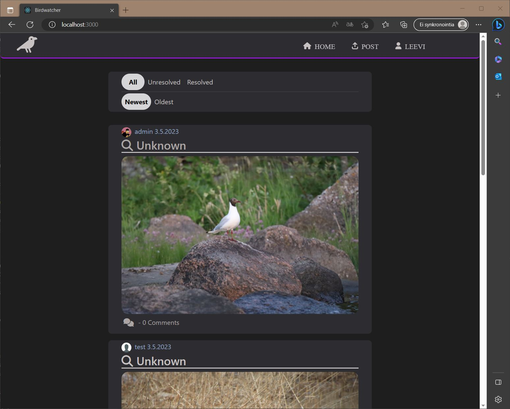
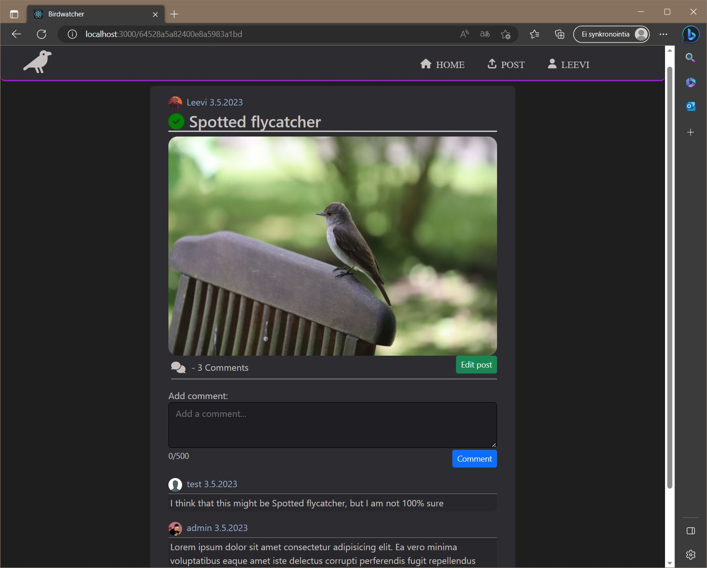
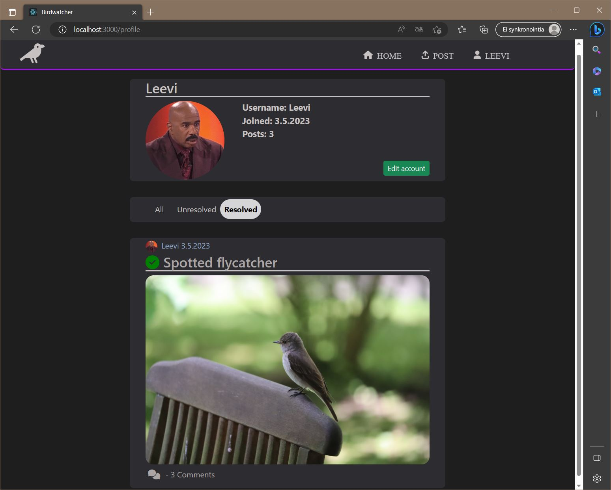
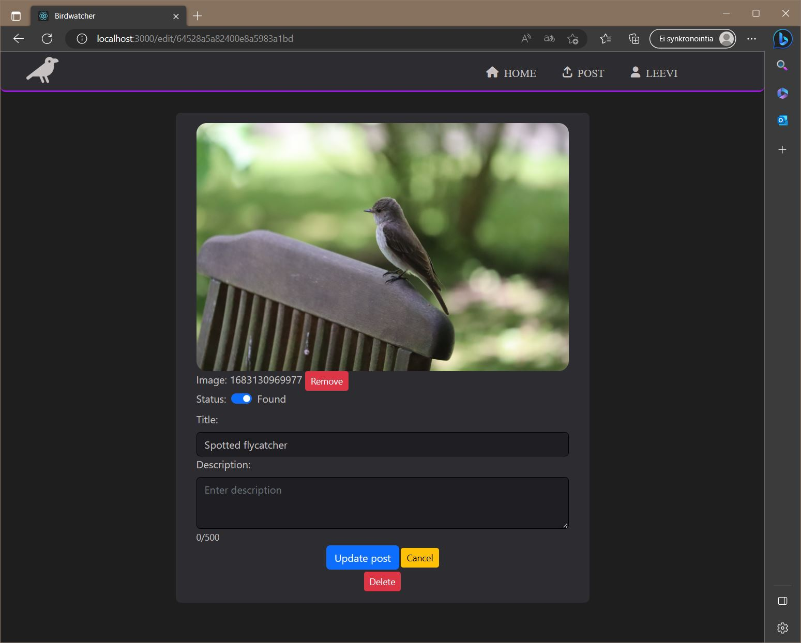

# SSSF Project: Birdwatcher

## Birdwatcher

Birdwatcher is app where you can post picture of birds which you are uncertain of it's species or name and other users can try identify it. 
You can also just post pictures of your sightings and users can like, comment them like in instagram. 
Main focus groups are professionals and casual birdwatchers who wants to share pictures of sightings or ask for help to identify birds.

## features:
### Implemented
- User can register account, edit and delete it
- User can create, edit, delete own post
- User can comment posts and edit/delete them
- User can view other users profiles, posts and comments
- Admin can create, edit, delete own post
- Admin can create, edit, delete own comments
### Partially implemented
- User can like any post (only in backend)
- Admin can like any post (only in backend)
- Admin can  dit, delete any post (only in backend)
- Admin can edit, delete any comment (only in backend)
- Admin can edit, delete any user account (only in backend)
### Missing/Backlog ideas
- User journal's (Keep records for your sightings)
- Notifications (about comments etc)
- AI recognition (for fast response or for help moderate app)

## Tools
### Used Main technologies:
- [Node.js](https://nodejs.org/en) 
- [React](https://react.dev)
- [graphql](https://graphql.org)
- [Express](https://mariadb.com/kb/en/about-mariadb-connector-j/) 
- [TypeScript](https://www.typescriptlang.org)
- [Jest](https://jestjs.io)

## Screenshots:
| Home | Post |
| --- | --- |
|  |  |

| Profile | Edit Post |
| --- | --- |
|  |  |

## Authors:
- [Leevi Koskinen](https://github.com/leba9999)

The project was completed as part of [Metropolia's](https://www.metropolia.fi) bachelor's degree, in the 3th year course: Server-side Scripting Frameworks

The development work of the application will no longer continue.

 

